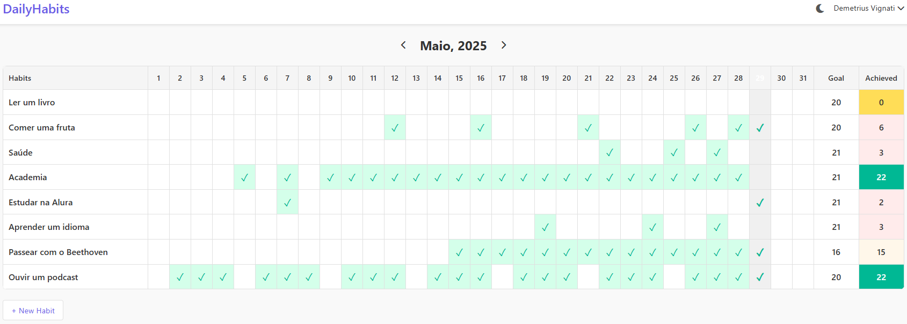

# Dialy Habits 🗓️

**Dialy Habits** é uma aplicação web simples para acompanhar e organizar seus hábitos diários. A proposta é ajudar no desenvolvimento pessoal por meio da criação de rotinas saudáveis e do monitoramento das tarefas concluídas diariamente.

## 📸 Print da Página

## 🌐 Acesse o Projeto

Você pode acessar o projeto online clicando no link abaixo:

🔗 [https://seusite.com/dialy-habits](https://seusite.com/dialy-habits)

## 🛠️ Tecnologias Utilizadas

- HTML5
- CSS3
- JavaScript (ou framework que estiver usando)